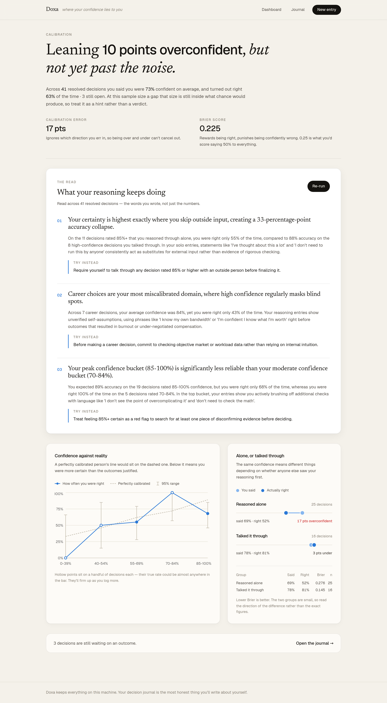
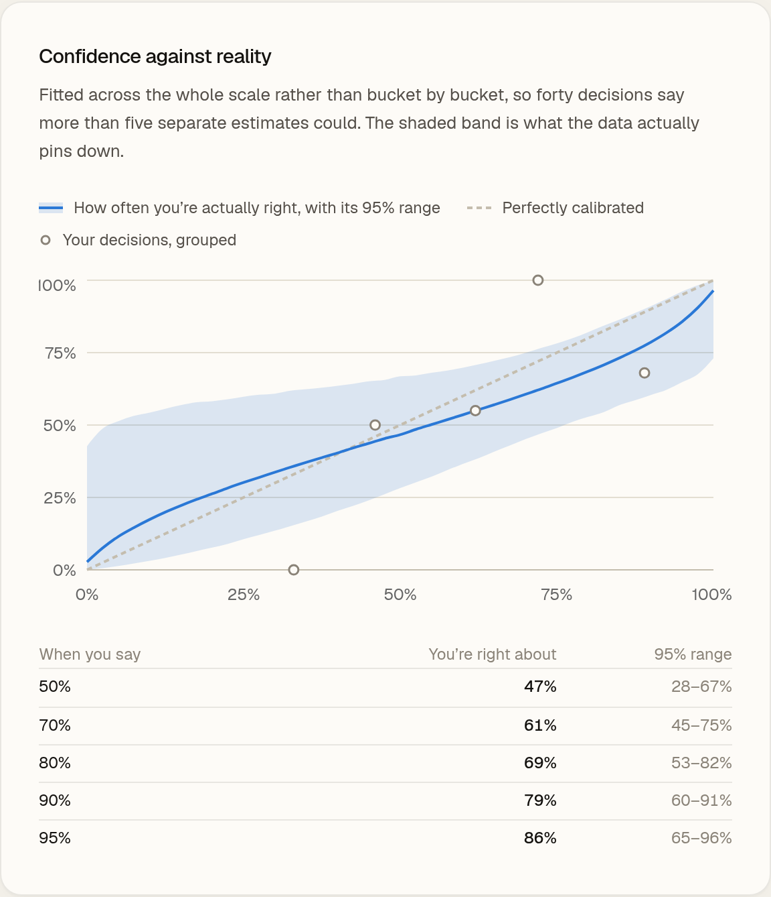

# Doxa

A decision journal that shows you where your confidence lies to you.

You log a decision *before* you know how it turns out — what you're deciding, your actual
reasoning, and how confident you are. Later you record what happened. Once enough
decisions have resolved, Doxa reads back across all of them and tells you where your
certainty and your accuracy come apart.



## Why

Human memory rewrites itself. After the fact you remember having been more sure, or less,
in whichever direction makes you look better. Decision journals exist because of that
specific failure — investors and forecasters keep them for exactly this reason — but the
tooling for them is mostly Notion templates.

The interesting part isn't the journal. It's what becomes visible once a year of entries
have resolved: not *"you were wrong about this decision"*, but *"here is the pattern in how
you reason that keeps making you wrong"* — a claim about how you think, which is the kind
of thing you can't tell yourself.

## What it does

- **Log a decision** with your reasoning, a confidence percentage, and when you expect to know.
- **Resolve it** later as right or wrong, with a note on what actually happened.
- **Calibration curve** — your stated confidence plotted against how often each confidence
  band actually turned out right, with 95% intervals.
- **Pattern analysis** — a Gemini pass over every resolved entry that looks for *why* the
  gap is there: the phrases you reach for, the categories where certainty runs ahead of
  evidence, the situations where you don't check your thinking.

Accuracy statistics are computed in code and handed to the model, so it never has to count
anything — it works on the reasoning text, which is the part statistics can't see.

## On not overclaiming

A tool about overconfidence has no business being overconfident, so:

- **Wilson intervals on every bucket.** A confidence band holding three decisions gets an
  error bar covering most of the scale, and renders hollow instead of solid.
- **Brier score and expected calibration error**, not just a hit rate. ECE is there because
  the intuitive metric — mean confidence minus accuracy — *cancels*: wildly overconfident at
  one end of the scale and equally underconfident at the other averages out to "perfectly
  calibrated". `src/lib/calibration.test.ts` pins that case.
- **The headline backs off when the data can't support it.** If the overall gap sits inside
  the confidence interval, the dashboard says "leaning overconfident, but not yet past the
  noise" rather than asserting a number.

Low-confidence predictions are not failures, either: saying 30% and being right 30% of the
time is *good* calibration, and the metrics treat it that way.



## Running it

```bash
npm install
cp .env.example .env      # then add your GEMINI_API_KEY
npx prisma migrate dev    # creates the SQLite database
npm run seed              # loads the demo journal
npm run dev
```

The key is free from [Google AI Studio](https://aistudio.google.com/apikey) — no credit card.

Open http://localhost:3000.

`npm run seed` loads a year of entries for a fictional user — 41 resolved, 3 still open — so
the dashboard has something to measure on first run. **The entries are written, not
collected**: they exist so the calibration and analysis features can be evaluated without
waiting a year. Every number on screen is computed honestly from them, but it is
illustrative data. Click **Find my patterns** to run the analysis over it.

Without a `GEMINI_API_KEY` everything works except the pattern analysis, which will tell
you the key is missing rather than failing silently.

Free-tier model availability moves around, so if the default model name is rejected:

```bash
npm run models   # lists what your key can actually reach
```

Then set `DOXA_MODEL` in `.env` to one of them. Flash-class models are the free ones — the
default is `gemini-3.6-flash`, since `gemini-2.5-flash` was retired for new keys.

To run it without the UI:

```bash
npm run analyze
```

## Tests

```bash
npm test
```

31 tests over the calibration maths — bucket boundaries, Wilson intervals, Brier score, the
ECE cancellation case, and the empty-journal paths.

### Shipping the analysis with the repo

Anyone browsing the project shouldn't need their own key just to see what it does, so a
run can be captured and committed:

```bash
npm run capture:analysis   # writes prisma/seed-analysis.json from your last run
```

`npm run seed` picks that file up, so a fresh clone opens on a dashboard already showing
model output with no key required. It replays a run that actually happened — the insights
are never hand-written, and if no run has been captured the panel stays empty and says so.

## The cold-start problem

Calibration needs *resolved* decisions, and the decisions worth journalling take months to
resolve — so a new journal is dead weight for a year. That's the real adoption problem with
every decision-journal tool.

Doxa's answer is that calibration is a general habit rather than a per-topic skill: someone
who says 90% when they mean 70% does it on small predictions too. So the empty state offers
short-horizon predictions that settle in three to fourteen days — *will I finish the thing I
keep postponing this week?* — which gives you a real baseline in a fortnight, ready to carry
into the slow decisions that actually matter.

## Known limitations

- **Self-reported resolution.** You grade your own outcomes, which is exactly where motivated
  reasoning lives.
- **Small samples.** At journal-sized n most findings are directional. The app says so on
  screen rather than hiding it, which is the honest half of the fix.

## Stack

Next.js 16 (App Router) · React 19 · TypeScript · Tailwind 4 · Prisma + SQLite · Recharts ·
Gemini API · Vitest
